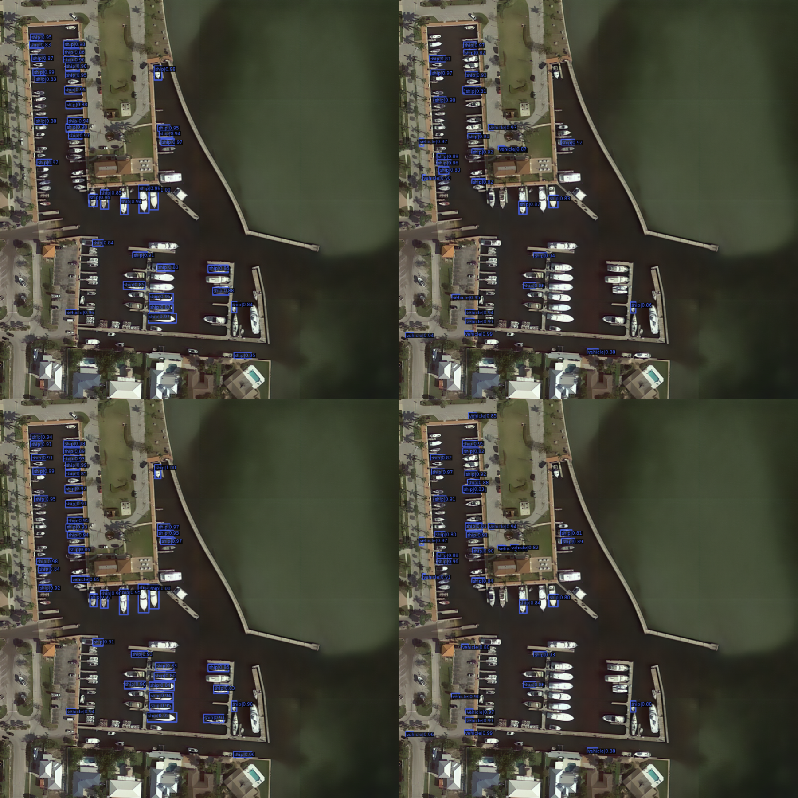
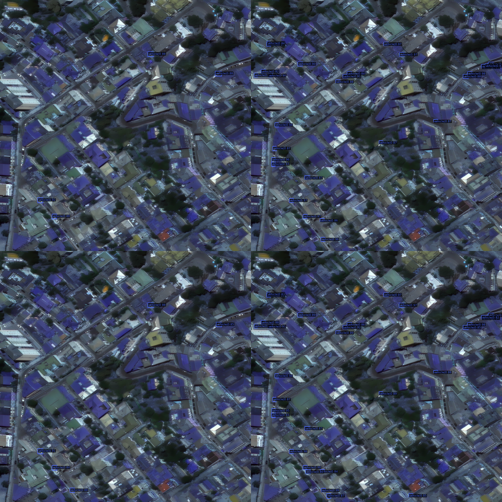
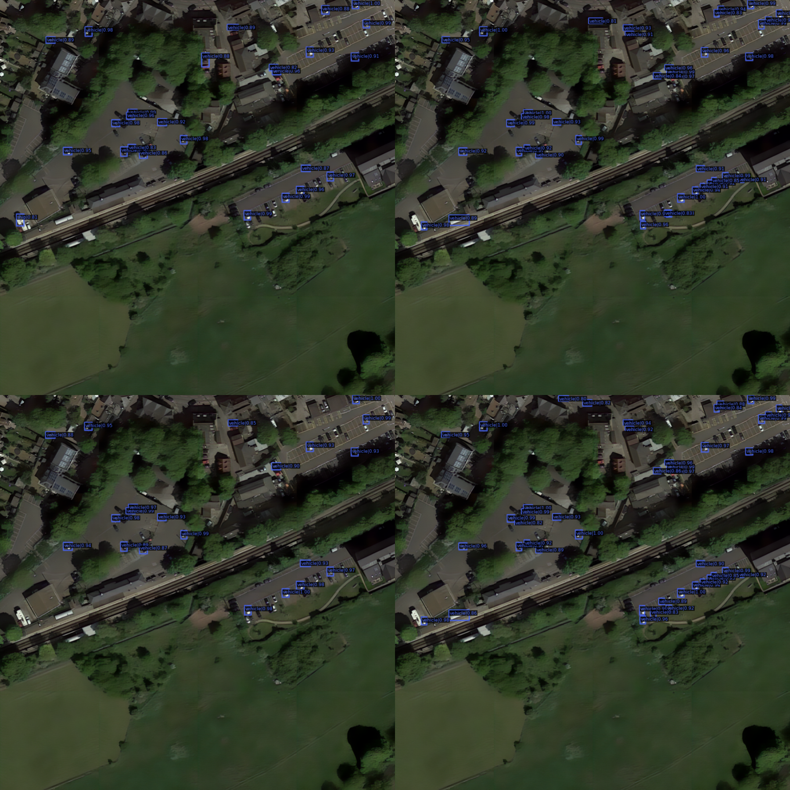
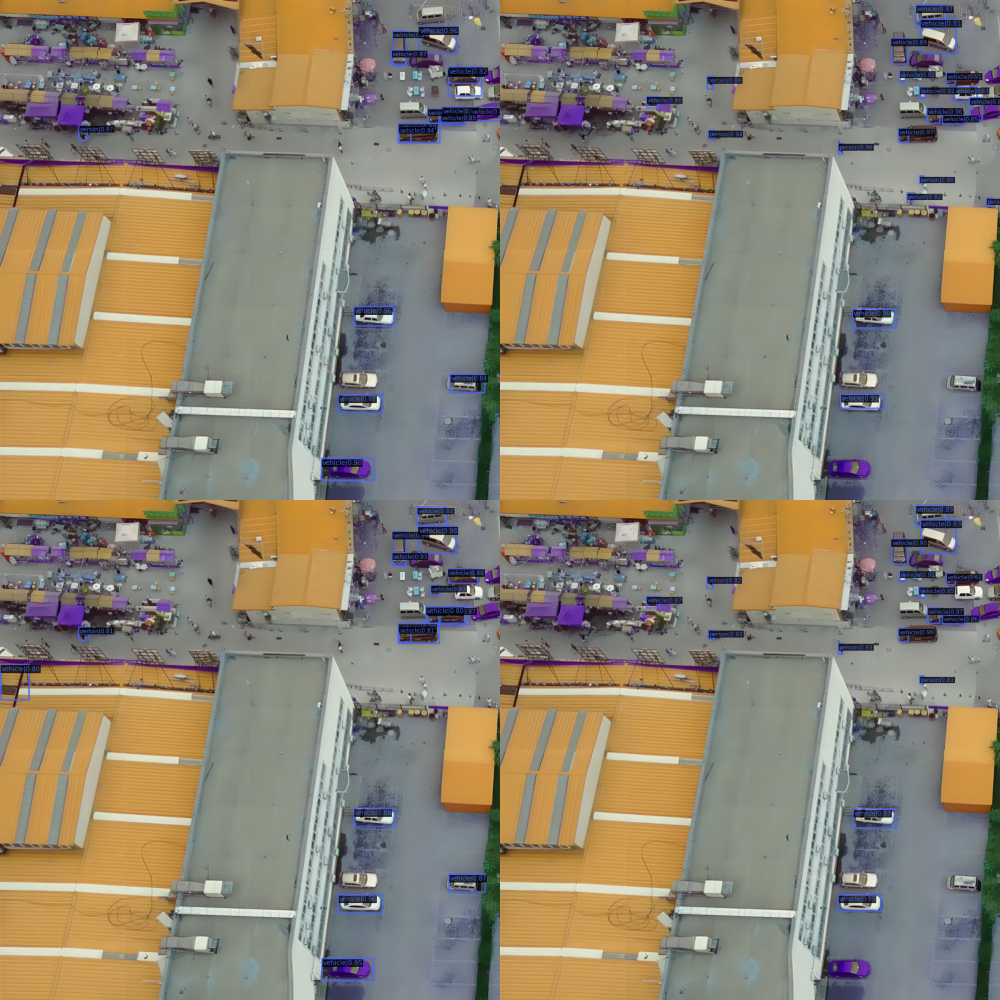
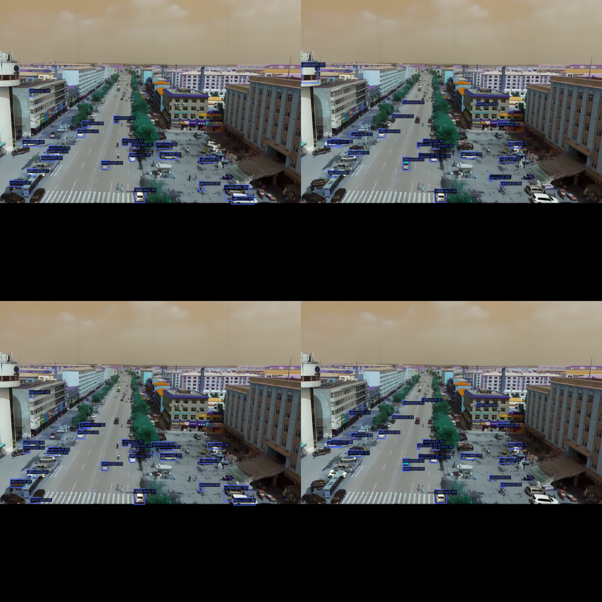
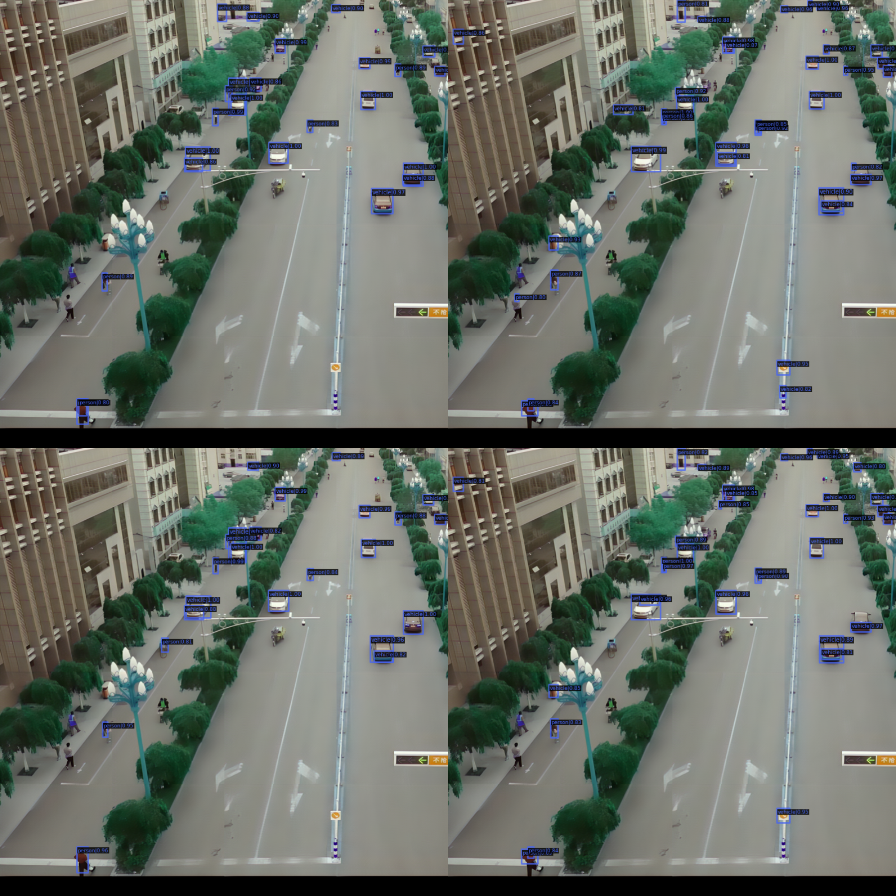

# Enhancing Tiny Object Detection in Aerial Imagery

**CMP722 Advanced Vision Final Project**

**Authors:** Muhammed Rıdvan Keleş & Refik Can Öztaş

This repository contains the implementation and results for the paper: **"Enhancing Tiny Object Detection in Aerial Imagery using Attention-based and Transformer-driven Tiling Strategies"**.

---

## Overview

This project focuses on **tiny object detection in aerial images** using the AI-TOD-v2 dataset. We implement and compare various detection methods with enhancements including:

- **Super-Resolution**: Real-ESRGAN 4× enhancement for improved input quality
- **Attention Mechanisms**: CSAM (Channel-Spatial Attention Module) for better feature selectivity
- **Stable Assignment**: NWD+RKA (Normalized Wasserstein Distance with Ranking-based Assignment) for tiny objects
- **Tiling Strategy**: 200×200 tile-based inference for increased effective resolution

### Key Results

- **Real-ESRGAN enhancement**: Improved mAP from 0.058 to 0.094 (62% relative improvement)
- **Best configuration (CSAM + NWD+RKA)**: Achieved mAP 0.108 with oLRP 0.875
- **Tiny object detection**: Significant improvements in AP_vt (very-tiny) and AP_t (tiny) metrics

---

## Repository Structure

```
mmdet-cmp722-finalproject/
├── README.md                              # This file
├── mmdet-nwdrka/                          # Core detection framework (MMDetection 2.24.1 based)
│   ├── configs_nwdrka/                    # Model configurations
│   │   ├── baseline/                      # Baseline methods
│   │   └── nwd_rka/                       # NWD-RKA and enhanced methods
│   ├── mmdet/                             # Modified MMDetection code
│   └── tools/                             # Training and testing scripts
├── realESRgan/                            # Super-resolution pipeline
│   ├── Real-ESRGAN/                       # Real-ESRGAN implementation
│   ├── super_resolution.py               # Main SR pipeline
│   └── train.py                           # Fine-tuning scripts
├── training_testing_inferece_notebook.ipynb  # Google Colab training notebook
├── figures/                               # Visual results
│   ├── qual_panels/                       # Qualitative comparison panels
│   │   ├── panel_02029.png               # Paper Figure 2 (left)
│   │   ├── panel_107__600_600.png        # Paper Figure 2 (right)
│   │   └── [6 additional panels]         # Additional examples
│   ├── nwdrka.PNG                         # Method overview diagram
│   └── fps2.gif                           # Dataset comparison animation
└── src/mmtrack/                           # MMTracking (included, not used in main project)
```

---

## Installation

### Requirements

- Linux (recommended) or Windows
- Python 3.8
- PyTorch 1.13.1+cu117
- CUDA 11.7+
- GCC 5+
- [MMCV-full 1.7.1](https://mmcv.readthedocs.io/)
- [cocoapi-aitod](https://github.com/jwwangchn/cocoapi-aitod)

### Setup

1. **Clone the repository:**
```bash
git clone https://github.com/mridvankeles/mmdet-cmp722-finalproject.git
cd mmdet-cmp722-finalproject
```

2. **Install MMDetection (TODbox):**
```bash
cd mmdet-nwdrka
pip install -r requirements/build.txt
python setup.py develop
```

3. **Install dependencies:**
```bash
pip install torch==1.13.1+cu117 torchvision==0.14.1+cu117 -f https://download.pytorch.org/whl/torch_stable.html
pip install -U openmim
mim install "mmcv-full==1.7.1"
mim install mmdet
pip install aitodpycocotools  # From: git+https://github.com/jwwangchn/cocoapi-aitod.git#subdirectory=aitodpycocotools
```

---

## Dataset

### AI-TOD-v2

- **Purpose**: Tiny object detection in aerial images
- **Classes**: 8 object categories
- **Characteristics**: Very small objects (often < 16×16 pixels)
- **Download**: [AI-TOD-v2 Dataset](https://drive.google.com/drive/folders/1Er14atDO1cBraBD4DSFODZV1x7NHO_PY?usp=sharing)

### Dataset Variants

1. **Standard AI-TOD-v2**: Original dataset
2. **aitod_super**: Real-ESRGAN 4× enhanced dataset (used in main experiments)

### Dataset Structure

```
data/
├── aitod_super/          # Super-resolved dataset
│   ├── annotations/      # COCO-format annotations
│   ├── trainval/         # Training/validation images
│   ├── test/             # Test images
│   └── stitched_val/     # Stitched validation images
└── aitodv2/              # Original AI-TOD-v2 dataset
```

---

## Key Methods

### 1. NWD-RKA (Normalized Wasserstein Distance with Ranking-based Assignment)

- Uses **Wasserstein distance** instead of IoU for better small object matching
- **Ranking-based assignment** strategy for anchor matching
- More stable training for tiny objects
- Implemented in: `mmdet-nwdrka/mmdet/core/bbox/assigners/ranking_assigner.py`

### 2. CSAM (Channel-Spatial Attention Module)

- Lightweight attention mechanism integrated into ResNet-50 backbone
- Applied to stages 3 and 4 of the backbone
- Improves feature selectivity and reduces false positives
- Includes transformer-inspired channel-wise self-attention

### 3. Super-Resolution with Real-ESRGAN

- **4× upscaling** applied to AI-TOD dataset
- Fine-tuned on **DOTA remote sensing dataset**
- Improves edge clarity and local contrast for tiny objects
- Applied as offline preprocessing step

### 4. Tiling Strategy

- **200×200 pixel tiles** with overlap
- Increases effective resolution for small targets
- Tile-level detections merged using class-wise NMS

---

## Configuration Files

### Available Configurations (`mmdet-nwdrka/configs_nwdrka/`)

#### Baseline Methods (`baseline/`)
- Standard Faster R-CNN, RetinaNet, Cascade R-CNN
- DetectoRS and HRNet variants

#### NWD-RKA Methods (`nwd_rka/`)

**AI-TOD-v2 dataset:**
- `aitodv2_faster_r50_nwdrka_1x.py` - NWD+RKA baseline
- `aitodv2_faster_r50_nwd_1x.py` - NWD only (no ranking)
- `aitodv2_faster_r50_dotd_1x.py` - Dot Distance method

**Super-resolved dataset (`aitod_super`):**
- `aitod_super_faster_r50_nwdrka_1x.py` - NWD+RKA + Plain ResNet-50
- `aitod_super_faster_r50_iou_1x.py` - IoU Ranking + Plain ResNet-50
- `aitod_super_faster_r50_csam_nwdrka_1x.py` - **NWD+RKA + CSAM ResNet-50 (Best)**
- `aitod_super_faster_r50_csam_iou_1x.py` - IoU Ranking + CSAM ResNet-50

---

## Training

### Using Google Colab

1. **Upload to Google Drive:**
   - Repository (`mmdet-nwdrka`)
   - Dataset (`aitod_super`)
   - Config files

2. **Open notebook:**
   - `training_testing_inferece_notebook.ipynb`

3. **Configure paths** in Cell 1:
```python
DRIVE_ROOT = '/content/drive/MyDrive'
REPO_PATH = f'{DRIVE_ROOT}/mmdet_nwdrka/mmdet-nwdrka'
DATASET_EXTRACTED_PATH = f'{DRIVE_ROOT}/mmdet_nwdrka/mmdet-nwdrka/data/aitod_super'
CONFIG_FILE = 'nwd_rka/aitod_super_faster_r50_csam_nwdrka_1x.py'
```

4. **Run cells sequentially:**
   - Cell 1: Mount Drive and configure paths
   - Cell 2: Setup Python 3.8 environment
   - Cell 4: Install aitodpycocotools
   - Cell 9-10: Training
   - Cell 12: Testing/Evaluation
   - Cell 17-19: Batch inference with visualization

### Training Parameters

- **Optimizer**: SGD (lr=0.01, momentum=0.9, weight_decay=0.0001)
- **Learning Rate**: Step schedule with warmup (step=[6, 15])
- **Epochs**: 30
- **Mixed Precision**: FP16 training enabled
- **Gradient Clipping**: Max norm 35
- **Batch Size**: Configured per dataset

### Training Command

```bash
cd mmdet-nwdrka
python tools/train.py configs_nwdrka/nwd_rka/aitod_super_faster_r50_csam_nwdrka_1x.py \
    --work-dir work_dirs/aitod_super_csam_nwdrka
```

### Testing Command

```bash
python tools/test.py configs_nwdrka/nwd_rka/aitod_super_faster_r50_csam_nwdrka_1x.py \
    work_dirs/aitod_super_csam_nwdrka/epoch_30.pth \
    --eval bbox \
    --out results.pkl
```

---

## Results

### Effect of Real-ESRGAN Enhancement

| Setting | mAP | AP₅₀ | AP₇₅ | AP_vt | AP_t | AP_s | AP_m | oLRP |
|---------|-----|------|------|-------|------|------|------|------|
| Standard AI-TOD-v2 (IoU) | 0.058 | 0.132 | 0.041 | 0.006 | 0.054 | 0.088 | 0.065 | 0.958 |
| Real-ESRGAN Enhanced (IoU) | **0.094** | **0.208** | **0.065** | **0.022** | **0.104** | **0.128** | **0.098** | **0.898** |

### Assignment and Attention Ablation (Tiled 200×200)

| Method | mAP | AP₅₀ | AP₇₅ | AP_vt | AP_t | AP_s | AP_m | oLRP |
|--------|-----|------|------|-------|------|------|------|------|
| Faster R-CNN (IoU) | 0.056 | 0.128 | 0.038 | 0.008 | 0.052 | 0.092 | 0.068 | 0.952 |
| Faster R-CNN (NWD+RKA) | 0.081 | 0.188 | 0.052 | 0.028 | 0.094 | 0.088 | 0.045 | 0.910 |
| Faster R-CNN + CSAM (IoU) | 0.089 | 0.205 | 0.058 | 0.012 | 0.078 | 0.172 | 0.185 | 0.902 |
| **Faster R-CNN + CSAM (NWD+RKA)** | **0.108** | **0.242** | **0.078** | **0.045** | **0.128** | **0.142** | **0.102** | **0.875** |

**Key Findings:**
- Real-ESRGAN enhancement improves mAP by 62% (0.058 → 0.094)
- NWD+RKA improves tiny object detection (AP_vt: 0.008 → 0.028)
- CSAM reduces false positives and improves small/medium objects
- Combined (CSAM + NWD+RKA) achieves best overall performance

---

## Visual Results

### Qualitative Comparison Panels

The `figures/qual_panels/` directory contains **8 automatically selected panels** showing 2×2 comparisons of four detection configurations. Each panel is a composite image demonstrating how different methods perform on the same validation scene.

#### Panel Layout

Each panel is organized as a 2×2 grid:

```
┌─────────────────┬─────────────────┐
│   IoU Baseline  │   NWD+RKA       │
│   (top-left)    │   (top-right)   │
├─────────────────┼─────────────────┤
│   CSAM + IoU    │   CSAM + NWD+RKA│
│   (bottom-left) │   (bottom-right) │
└─────────────────┴─────────────────┘
```

#### Panels from Paper (Figure 2)

**Panel 1: `panel_02029.png`** (Figure 2, left panel)



This panel demonstrates a typical aerial scene with multiple small objects. Key observations:
- **IoU baseline (top-left)**: Misses several tiny objects, especially in dense areas
- **NWD+RKA (top-right)**: Recovers additional tiny instances that IoU missed, showing improved recall
- **CSAM + IoU (bottom-left)**: Reduces some false positives but still misses tiny objects
- **CSAM + NWD+RKA (bottom-right)**: Best configuration - combines improved recall (from NWD+RKA) with reduced false positives (from CSAM)

**Panel 2: `panel_107__600_600.png`** (Figure 2, right panel)



This panel shows a different scene type with varying object sizes. Observations:
- **IoU baseline**: Struggles with very small objects and produces some false positives
- **NWD+RKA**: Better detection of tiny objects, but may introduce a few false positives
- **CSAM + IoU**: Good precision but misses some tiny targets
- **CSAM + NWD+RKA**: Optimal balance - detects more tiny objects while maintaining high precision

#### Additional Example Panels

**Panel 3: `panel_00844.png`**


Demonstrates performance on a scene with moderate object density. The combined method (CSAM + NWD+RKA) shows the cleanest results with good coverage of all object sizes.

**Panel 4: `panel_01979.png`**



Shows how different methods handle cluttered backgrounds. CSAM helps reduce false positives from background patterns, while NWD+RKA improves detection of genuinely small targets.

**Panel 5: `panel_00761707d.png`**


Illustrates performance on scenes with sparse object distribution. NWD+RKA particularly shines here by detecting objects that IoU-based methods miss.

**Panel 6: `panel_0000133_00078_d_0000141__0_0.png`**



Example of a complex scene with multiple object scales. The progression from top-left to bottom-right shows clear improvement in both recall and precision.

**Panel 7: `panel_0000244_05400_d_0000012__160_0.png`**



Demonstrates the importance of stable assignment (NWD+RKA) for very tiny objects that are easily missed or misclassified.

**Panel 8: `panel_0000270_03801_d_0000372__0_0.png`**



Shows how attention mechanisms (CSAM) help the model focus on relevant features and suppress background noise.

### Key Observations from Panels

1. **NWD+RKA Benefits:**
   - **Improved recall** for very tiny objects (often missed by IoU)
   - Better handling of objects near detection boundaries
   - More stable positive sample assignment during training
   - Particularly effective for objects < 16×16 pixels

2. **CSAM Benefits:**
   - **Reduced false positives** from background clutter
   - Better feature selectivity for weak target cues
   - Improved discrimination between objects and background
   - Helps with medium-sized objects as well

3. **Combined Configuration (CSAM + NWD+RKA):**
   - **Best overall performance**: Highest mAP (0.108) and lowest oLRP (0.875)
   - Balances improved recall (from NWD+RKA) with reduced false positives (from CSAM)
   - Most consistent detection quality across different scene types
   - Handles both sparse and dense object distributions well

### Method Overview Diagram


This diagram illustrates the Normalized Wasserstein Distance and Ranking-based Assigning strategy (NWD-RKA) approach for tiny object detection.

### Dataset Comparison


Animation showing the comparison between AI-TOD and AI-TOD-v2 datasets, highlighting improvements in annotation quality and coverage.

---

## Super-Resolution Pipeline

### Generating Enhanced Dataset

1. **Fine-tune Real-ESRGAN** (optional, can use pretrained):
```bash
cd realESRgan
python train.py --config config.yaml
```

2. **Apply super-resolution:**
```bash
python super_resolution.py
```

3. **Process annotations** for enhanced images:
```bash
python stitch.py  # Stitch tiles if needed
```

---

## Citation

If you use this repository in your research, please cite:

```bibtex
@inproceedings{Keles2025Enhancing,
  title={Enhancing Tiny Object Detection in Aerial Imagery using Attention-based and Transformer-driven Tiling Strategies},
  author={Keleş, Muhammed Rıdvan and Öztaş, Refik Can},
  booktitle={IEEE Conference},
  year={2025}
}
```

### Related Work

This project builds on:

```bibtex
@article{Xu2022NWD,
  title={Detecting tiny objects in aerial images: A normalized Wasserstein distance and a new benchmark},
  author={Xu, Chang and Wang, Jinwang and Yang, Wen and Yu, Huai and Yu, Lei and Xia, Gui-Song},
  journal={ISPRS Journal of Photogrammetry and Remote Sensing},
  volume={190},
  pages={79--93},
  year={2022}
}

@inproceedings{Wang2021AITOD,
  title={Tiny Object Detection in Aerial Images},
  author={Wang, Jinwang and Yang, Wen and Guo, Haifeng and Zhang, Ruixiang and Xia, Gui-Song},
  booktitle={Proc. ICPR},
  pages={3791--3798},
  year={2021}
}
```

---

## References

- [AI-TOD](https://github.com/jwwangchn/AI-TOD) - Original dataset
- [AI-TOD-v2](https://drive.google.com/drive/folders/1Er14atDO1cBraBD4DSFODZV1x7NHO_PY?usp=sharing) - Enhanced dataset
- [MMDetection](https://github.com/open-mmlab/mmdetection) - Detection framework
- [TODbox (mmdet-aitod)](https://github.com/Chasel-Tsui/mmdet-aitod) - Base implementation
- [Real-ESRGAN](https://github.com/xinntao/Real-ESRGAN) - Super-resolution model

---

## Contact

- **Muhammed Rıdvan Keleş**: mridvakeles25@hacettepe.edu.tr
- **Refik Can Öztaş**: refikoztas@hacettepe.edu.tr

---

## License

This project is based on:
- MMDetection (Apache 2.0)
- Real-ESRGAN (BSD 3-Clause)
- TODbox (see original repository)

Please refer to individual component licenses for details.

---

## Acknowledgments

- Hacettepe University, Computer Engineering Department
- CMP722 Advanced Vision course instructors
- OpenMMLab community for MMDetection framework
- Real-ESRGAN authors for super-resolution implementation
